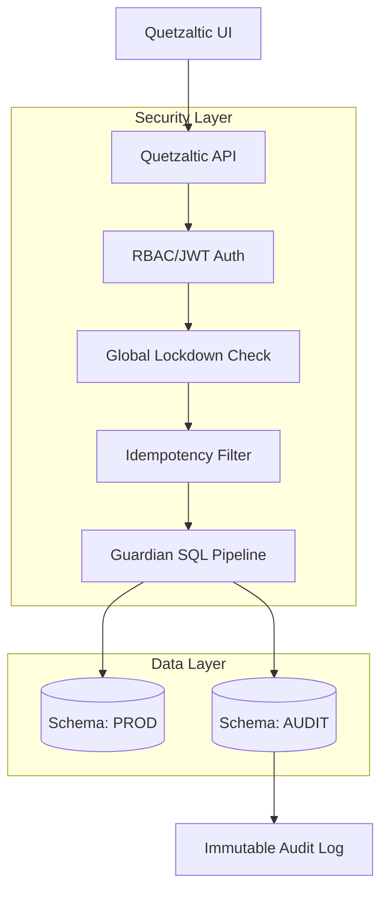

# Quetzaltic: Production-Ready Governance & Security

Sistema de orquestación transaccional con principios de **Zero-Trust**, **Guardian Pipeline** y **Gobernanza Avanzada**.

## 🏗️ Arquitectura General

El sistema se basa en una arquitectura de capas concéntricas donde cada operación debe atravesar múltiples filtros de seguridad antes de tocar la base de datos productiva.



## 🛡️ Guardian Pipeline

El **Guardian** es el corazón de la seguridad. No es solo un validador; es un proxy inteligente que analiza cada sentencia SQL.

1.  **Parsing**: Descompone la query usando `pgsql-ast-parser`.
2.  **Whitelist Enforcement**: Solo permite operaciones sobre tablas y columnas autorizadas.
3.  **Command Restriction**: Bloquea sentencias DDL (DROP, ALTER) y comandos peligrosos.
4.  **Audit Capturing**: Genera snapshots `before` y `after` para cada cambio de estado.

## 🔄 Flujo Transaccional & Resiliencia

### Idempotencia
Cada petición requiere un `X-Idempotency-Key`. El sistema garantiza que:
- **Replay Protection**: Re-envíos de la misma clave retornan el resultado cacheado sin re-ejecutar.
- **Collision Block**: Claves iguales con payloads distintos son rechazadas.

### Assisted Rollback (Detección de Drift)
El sistema permite revertir cualquier evento de auditoría. Antes de aplicar el rollback, el **Drift Detector** compara el estado actual de la fila con el snapshot `after` guardado. Si hay discrepancias (cambio externo), el rollback se bloquea por seguridad.

## 🔐 Zero-Trust & Security Posture

| Amenaza | Mecanismo de Mitigación | Estado |
| :--- | :--- | :--- |
| SQL Injection | Guardian Pipeline (AST Parsing + Whitelist) | ✅ Protegido |
| Privilege Escalation | RBAC Estricto (ADMIN/OPERATOR) | ✅ Protegido |
| Data Drift | Atomic Drift Detection on Rollback | ✅ Protegido |
| Race Conditions | Redis/DB Lock en Idempotencia | ✅ Protegido |
| System Sabotage | Global Emergency Lockdown Mode | ✅ Protegido |

### Modelo de Confianza
- **Fail-Closed**: Por defecto, cualquier ruta no autorizada está bloqueada.
- **Least Privilege**: Los operadores solo ven logs; solo administradores gestionan políticas.
- **Audit trail**: Todo cambio es persistido de forma inmutable.

## 🚀 Despliegue con Docker (Reproducible)

### Requisitos
- Docker y Docker Compose v2+

### Quick Start
```bash
# 1. Clonar y configurar entorno
cp .env.example .env

# 2. Levantar el stack (DB + API + UI)
docker-compose up -d --build

# 3. La API ejecutará automáticamente:
# - prisma migrate deploy
# - seed-data.ts (Carga usuarios y tablas demo)
```

### Ejecutar Pruebas E2E (Hardening Suite)
```bash
# Levanta entorno de test aislado y ejecuta suites
./scripts/run-e2e.sh
```

## 🛠️ Credenciales de Seed (Default)
- **Admin**: `admin@quetzaltic.com` / `admin_secret_2026`
- **Operator**: `operator@quetzaltic.com` / `operator_secret_2026`

> [!WARNING]
> Cambie las contraseñas base y el `JWT_SECRET` en el archivo `.env` antes de exponer el sistema a la red.
