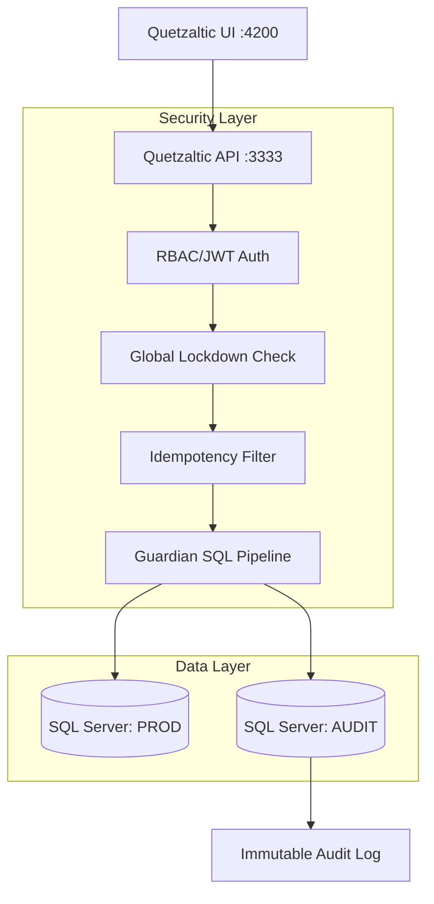

# Quetzaltic: Production-Ready Governance & Security

Sistema de orquestación transaccional con principios de **Zero-Trust**, **Guardian Pipeline** y **Gobernanza Avanzada**.

## 🏗️ Arquitectura General

El sistema se basa en una arquitectura de capas concéntricas donde cada operación debe atravesar múltiples filtros de seguridad antes de tocar la base de datos productiva.



## 🛡️ Guardian Pipeline

El **Guardian** es el corazón de la seguridad. No es solo un validador; es un proxy inteligente que analiza cada sentencia SQL.

1.  **Parsing**: Descompone la query usando `pgsql-ast-parser` (normalizado para SQL Server).
2.  **Whitelist Enforcement**: Solo permite operaciones sobre tablas y columnas autorizadas.
3.  **Command Restriction**: Bloquea sentencias DDL (DROP, ALTER) y comandos peligrosos.
4.  **Audit Capturing**: Genera snapshots `before` y `after` en formato JSON para cada cambio de estado.

## 🔄 Flujo de Reversión (Rollback)

A diferencia de un `ROLLBACK` de SQL tradicional, Quetzaltic implementa una **Reversión por Estado**:
- **Snapshots**: Se almacena el JSON del registro previo en `audit_events`.
- **Inverse Update**: Al ejecutar una reversión, el sistema genera un `UPDATE` dinámico con los datos del snapshot.
- **Auditoría de Reversión**: Cada rollback genera su propio evento de auditoría (`RB-`), manteniendo la trazabilidad total.

## 🔐 Zero-Trust & Security Posture

| Amenaza | Mecanismo de Mitigación | Estado |
| :--- | :--- | :--- |
| SQL Injection | Guardian Pipeline (AST Parsing + Whitelist) | ✅ Protegido |
| Privilege Escalation | RBAC Estricto (ADMIN/OPERATOR) | ✅ Protegido |
| Port Conflict | Absolute Path Interceptor (Local 3333/4200) | ✅ Resuelto |
| System Sabotage | Global Emergency Lockdown Mode | ✅ Protegido |

### Modelo de Confianza
- **Fail-Closed**: Por defecto, cualquier ruta no autorizada está bloqueada.
- **Least Privilege**: Los operadores solo ven logs; solo administradores gestionan políticas.
- **Audit trail**: Todo cambio es persistido de forma inmutable.

## 🚀 Desarrollo Local

### Requisitos
- Node.js v18+
- SQL Server Local/Cloud (Configurar en `.env`)

### Comandos Principales
```bash
# 1. Instalar dependencias
npm install

# 2. Levantar API (Puerto 3333)
npx nx run quetzaltic-api:serve

# 3. Levantar UI en modo estático (Puerto 4200)
npx nx run quetzaltic-ui:serve-static --port 4200
```

### Ejecutar Pruebas E2E (Hardening Suite)
```bash
# Levanta entorno de test aislado y ejecuta suites
./scripts/run-e2e.sh
```

## 🛠️ Credenciales de Acceso (Local)
- **Admin**: `admin` / `12345678`
- **Soporte**: `soporte` / `support_quetzal_2026`

> [!WARNING]
> Cambie las contraseñas base y el `JWT_SECRET` en el archivo `.env` antes de exponer el sistema a la red pública.
